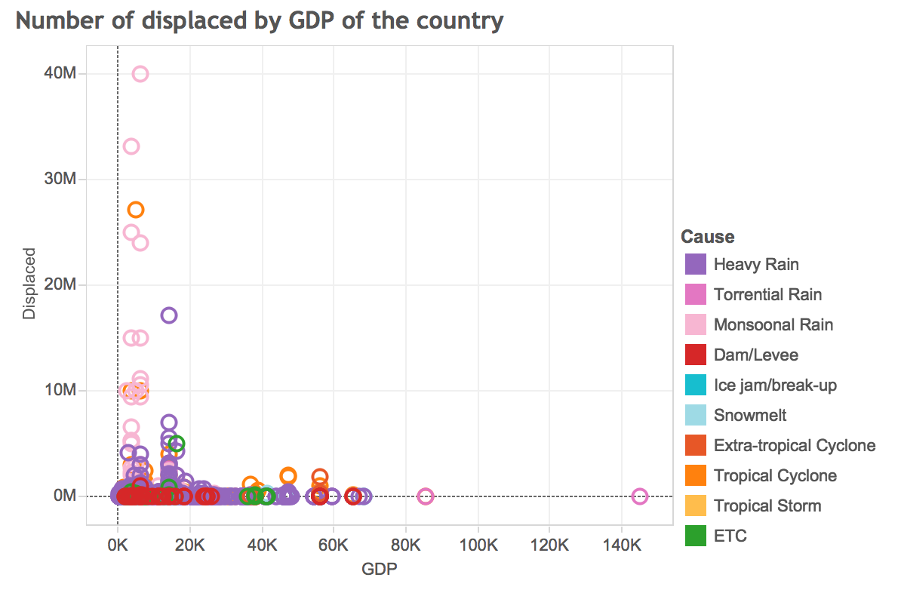

The part below is made as an interactive graph where you can choose which data you want to see using filters. We published it on Tableau Public, and you can try it using this link [(Click)](https://public.tableau.com/views/EDAVProject2_0/Graphs?:embed=y&:showTabs=y). There are 3 tabs showing different information and views.

To see a possible correlation between the wealth of the country and the flooding records, we included GDP data of the country, and classified the GDP into 3 levels: below $6,000, between $6,000 and $35,000, and above $35,000. Since the flooding data is collected over 30 years, and the GDP data is for 2014, it doesn’t show exact correlation, but may give an overall trend.
The table below shows the number of countries and flooding records in each GDP levels.

GDP Level | Number of Countries | Number of Flooding Records
------------- | ----------------|-------------------
Above $35,000 | 27 | 959
$6,000 ~ $35,000 | 86 | 2414
Below $6,000 | 57 | 833

These graphs show the number of floods in each year. You can set the "Magnitude Threshold" slide on left top of the graph to only show the number of floods exceeding the threshold. As we can see in the first figure, when we didn't set the threshold, there was no apparent trend. However, when we increase the threshold to 6.5, we can see that there is a trend of increasing occurence of severe flood (magnitude > 6.5).

This graph shows the number of floods by cause. Heavy rain, torrential rain and monsoonal rain are the top three reasons for flood. The color of the bar represents the GDP level of the country: blue – GDP greater than $35,000, green - GDP between $6,000 and $35,000, orange – GDP below $6,000. The proportion of the colors in each bar shows the proportion of the countries in terms of the GDP level. Considering the number of countries in the middle level ($6,000 ~ $35,000) is larger than other levels, there is no apparent relationships between flood cause and GDP level.

This graph shows the trend of number of floods caused by different reasons in each month. This shows the characteristics of the cause, because some of the the distributions are depend on the time of the year. For example, the number of floods caused by heavy rain, monsoonal rain, and torrential rain are the highest during summer (June – August), while the number of floods caused by tropical cyclone is the highest during September. The number of floods cause by snowmelt was the highest from March to April, which is expected.

This graph shows the number of displaced by GDP, cause of each flood marked by color. We can see the flooding record with large displaced are all below GDP $20,000. 

This graph shows the geographical location of each flood with affected area shown by the size of each circle, and the cause shown by color. 

The floods caused by heavy rain is well distributed around the world, while floods caused by snowmelt or ice is mostly in northern area, and floods caused by tropical storm or tropical cyclone are near equator. 

This graph shows similar information, but we can filter by the year and the cause. The graph below shows floods caused by tropical storms in 2012. The large circle around New York City and New Jersey shows the super storm Sandy.

